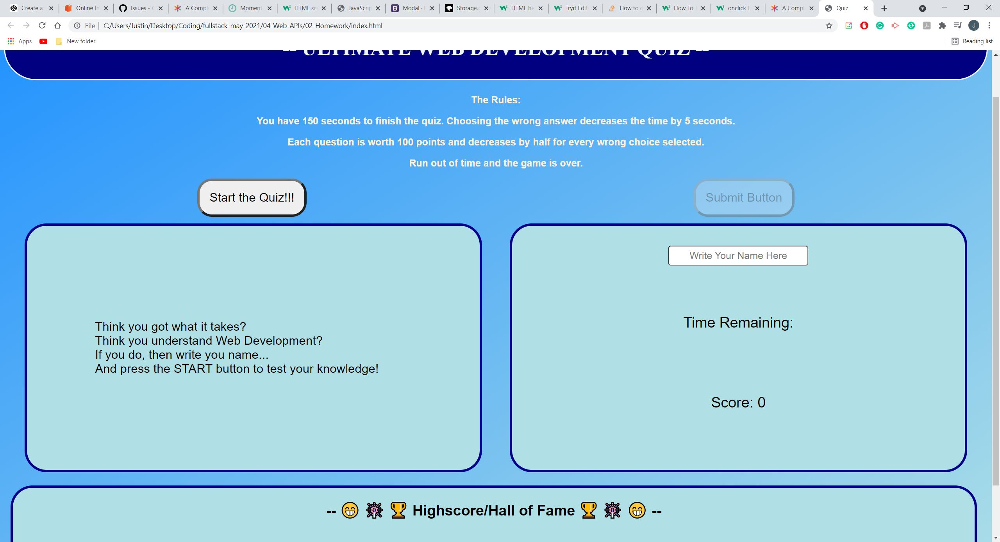

# Quiz-Show - HW
Coding Basic Quiz 

## Overview/Description
This project is to test the knowledge of Web APIs in conjunction with the other aspects of web development like HTML, CSS, and Javascript. The project will test the developers knowledge when it comes to Web Development, spefically in the area of Web APIs. They will learn how to take data and store them locally and then call them forward.

## Goal
The goal is to create a quiz that users can take to test their knowledge on Web Development. Based on the answer they choose, they will get a score. The basic rule are so: a corrent answer on the first try gives full points while every wrong answer reduces the point value by half. In addition, every wrong answer decreases the amount of time that the user has to answer the quiz. Once the quiz is done or the time runs out, the user can submit their time and score into a highscore area.

## Key Topics
* Web APIs
  * Objects
  * DOMs
  * Setting Attributes
  * Events and Listeners
  * Time Intervals
  * Local Storages
  * getElementById
  * ClearInterval
  * .textContent
  * localStorage

## Learning Objectives
* How to use Event Listeners to have specific functions for buttons
* How to store strings in localStorage
* How to retrieve data from localStorage
* Pull specific objects in Arrays
* Creating an array with Objects with multiple Attributes
* How to get element IDs and replace text through javascript

## Screeshots/Image
-- Basic code structure and questions in the quiz --

-- Basic Web application of the site --

-- Adding a Timer to  the Quiz --

-- Button Event Listeners for Answer Selection --

-- Grabbing Choice Elements --

-- More Stylized Web Application --

-- Highscore Added --

-- Final Product --

## Working Application

GitHub Repo: https://github.com/jyliao369/Quiz-Show

Web Application Site: https://jyliao369.github.io/Quiz-Show/